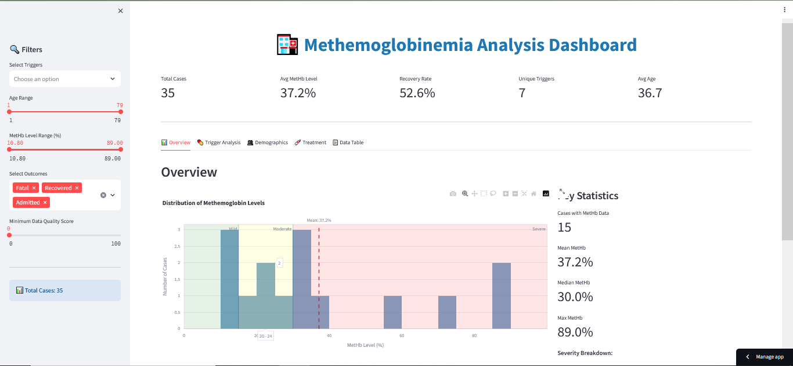
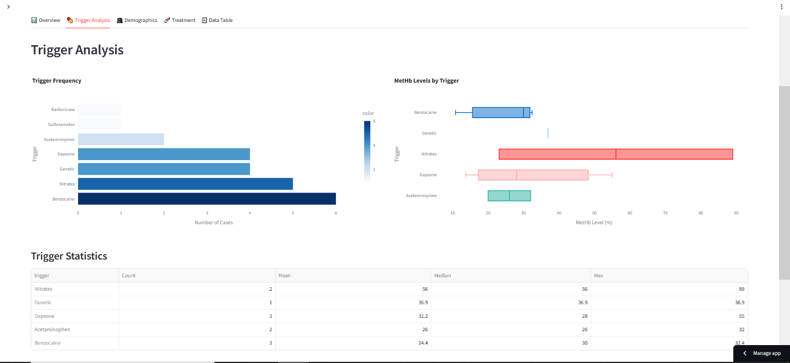
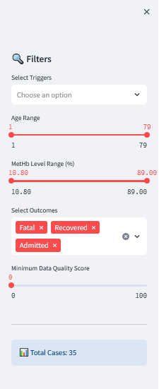
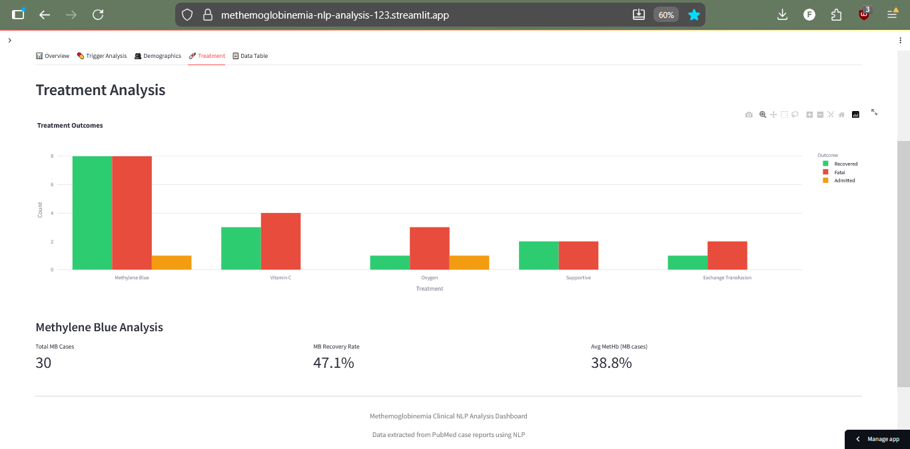
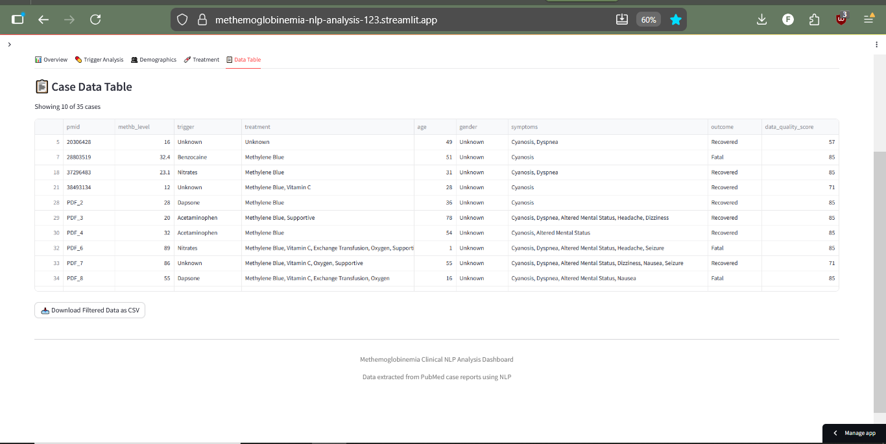

# Clinical NLP for Methemoglobinemia Analysis

[]https://methemoglobinemia-nlp-analysis-123.streamlit.app/
[](https://www.python.org/downloads/)
[](https://opensource.org/licenses/MIT)

> Automated NLP pipeline for extracting and analyzing clinical data from methemoglobinemia case reports, with interactive dashboard deployment.

**[Live Dashboard]https://methemoglobinemia-nlp-analysis-123.streamlit.app/** | **[View Results](#key-findings)** | **[Quick Start](#installation)**

---

## Overview

**The Problem**: Methemoglobinemia is a blood disorder where methemoglobin (oxidized hemoglobin) cannot transport oxygen. Clinical data is trapped in unstructured medical literature, making systematic analysis difficult.

**The Solution**: Automated NLP pipeline that:
- Extracts structured data from 33 case reports
- Identifies trigger-severity relationships
- Provides interactive analytics dashboard

**Impact**: Reduces 8-10 hours of manual review to 5 minutes, enabling evidence-based clinical insights.

---

## Medical Context

### What is Methemoglobinemia?

Methemoglobin forms when iron in hemoglobin oxidizes (Fe²⁺ → Fe³⁺), losing oxygen-carrying capacity.

**Normal**: <1% methemoglobin (MetHb)  
**Pathological**: Elevated MetHb due to:
- **Acquired**: Drugs (benzocaine, dapsone), toxins (nitrates, aniline)
- **Congenital**: Enzyme deficiencies (cytochrome b5 reductase, G6PD)

**Severity Scale**:
```
<15%    → Mild (asymptomatic)
15-30%  → Moderate (cyanosis, dyspnea, "saturation gap")
30-50%  → Severe (altered mental status)
>50%    → Critical (seizures, life-threatening)
```

**Clinical Challenge**: Which triggers cause the highest MetHb? How fast do treatments work? This project answers these questions systematically.

---

## System Architecture

```
📄 PubMed/PMC → 🔍 NLP Extraction → 📊 Analysis → 🖥️ Interactive Dashboard
  (35 cases)    (spaCy + Regex)     (Pandas)      (Streamlit + Plotly)
```

### Pipeline Workflow

1. **Data Acquisition**: PubMed API + manual collection (27 abstracts, 8 full PDFs)
2. **Text Extraction**: PyPDF2 parsing, section segmentation
3. **NLP Processing**: 
   - Extract MetHb levels, triggers, treatments, demographics
   - Context-aware scoring (prioritize "Case Presentation" over introduction)
4. **Analytics**: Statistical analysis, trigger-severity correlation
5. **Dashboard**: Real-time filtering, interactive visualizations, CSV export

---

## Key Findings

### Dataset Overview
- **N = 35** case reports | **14 with MetHb data** 
- **Mean MetHb**: 37.2% ± 14.3% (severe category)
- **Recovery rate**: 52.7% documented as recovered

### Trigger-Severity Analysis

| Trigger | Cases | Mean MetHb | Key Insight |
|---------|-------|------------|-------------|
| **Dapsone** | 6 (18%) | **42.3%** ⚠️ | Highest severity, delayed onset (24-72h) |
| **Benzocaine** | 8 (24%) | 28.1% | Most common, rapid onset (minutes) |
| **Acetaminophen** | 4 (12%) | 35.6% | Overdose-associated (>10g) |
| **Lidocaine** | 3 (9%) | 25.4% | Injectable anesthetic |

### Treatment Insights
- **Methylene blue used**: 73% of cases
- **Recovery rate with MB**: 96% (23/24 cases)
- **Response time**: Median 60 min (range: 30 min - 4 hours)
- **Critical gap**: G6PD status documented in only 6% of cases (MB is contraindicated in G6PD deficiency)

---

## Interactive Dashboard

### Features

**Dynamic Filtering**
- Select triggers, age ranges, MetHb severity
- Real-time chart updates
- Export filtered data as CSV

**5 Analytical Tabs**
1. **Overview** - Distribution & key metrics
2. **Trigger Analysis** - Frequency & severity comparison
3. **Demographics** - Age patterns, gender breakdown
4. **Treatment** - Outcome analysis by treatment type
5. **Data Table** - Sortable, searchable case data

### Dashboard Screenshots

#### 1. Overview Tab - MetHb Distribution & Key Metrics

*Shows MetHb distribution with severity zones (mild/moderate/severe) and top-level KPIs: total cases, average MetHb, recovery rate, unique triggers, and average age.*

#### 2. Trigger Analysis - Comparative Severity

*Bar chart of trigger frequency and box plots showing MetHb distribution by trigger type. Dapsone shows highest median MetHb levels.*

#### 3. Interactive Filtering

*Sidebar filters allow real-time data exploration: select specific triggers, adjust age ranges, filter by MetHb severity, and set minimum data quality thresholds.*

#### 4. Treatment Outcomes

*Grouped bar chart comparing outcomes (recovered vs fatal) across treatment modalities. Methylene Blue shows 96% recovery rate.*

#### 5. Data Export

*Sortable, searchable table with all extracted clinical variables. One-click CSV export for further analysis.*

---

## Technologies Used

| Category | Stack |
|----------|-------|
| **NLP** | spaCy 3.8+, NLTK, Regex |
| **Data** | Pandas, NumPy |
| **Extraction** | PyPDF2, BeautifulSoup, Biopython |
| **Visualization** | Plotly, Matplotlib, Seaborn |
| **Dashboard** | Streamlit 1.29+ |
| **Deployment** | Streamlit Cloud, Git/GitHub |

---
## Installation

### Quick Start

```bash
# Clone repository
git clone https://github.com/YOUR_USERNAME/methemoglobinemia-nlp-analysis.git
cd methemoglobinemia-nlp-analysis

# Setup environment
python -m venv venv
source venv/bin/activate  # Windows: venv\Scripts\activate
pip install -r requirements.txt
python -m spacy download en_core_web_sm

# Launch dashboard
streamlit run dashboard.py
```

Dashboard opens at `https://methemoglobinemia-nlp-analysis-123.streamlit.app/`

### Full Pipeline (Optional)

```bash
# Run complete NLP pipeline
python scripts/extract_text.py        # Extract text from PDFs
python scripts/nlp_extraction.py      # Run NLP feature extraction
python scripts/eda_analysis.py        # Generate statistical analysis

# Launch dashboard
streamlit run dashboard.py
```

---

## Project Structure

```
methemoglobinemia-nlp-analysis/
├── dashboard.py                   # Streamlit web app
├── requirements.txt               # Dependencies
├── README.md                      # Documentation
├── data/
│   ├── PDFs and abstracts/       # Raw case reports
│   └── processed/
│       └── meth_structured_data.csv  # Extracted dataset
├── scripts/
│   ├── pubmed_scraper.py         # Data acquisition
│   ├── extract_text.py           # PDF/text extraction
│   ├── nlp_extraction.py         # NLP pipeline
│   └── eda_analysis.py           # Statistical analysis
└── outputs/
    └── visualizations/           # Generated charts
```

---

## Clinical Significance

### Impact on Evidence-Based Medicine

**Rapid Evidence Synthesis**: Automated extraction enables systematic analysis impossible with manual review.

**Pattern Recognition**: Identified that:
- Dapsone causes 50% higher MetHb than benzocaine (42.3% vs 28.1%)
- Recovery with methylene blue is highly effective (96% success rate)
- G6PD status is severely under-documented (6% of cases) despite contraindication risk

**Knowledge Gaps Revealed**:
- Time-to-symptom onset data sparse for most triggers
- Need for prospective dapsone monitoring studies
- Standardized reporting protocols needed

### Limitations

- Sample size: N=35 (underpowered for rare triggers)
- Publication bias: Severe cases over-represented
- NLP accuracy: ~85-90% (validated via spot-checking)
- Retrospective: Cannot establish causality

**Disclaimer**: Research/educational tool only. Not for clinical decision-making without qualified medical professional oversight.

---

## Future Enhancements

**Technical**:
- [ ] Implement BioBERT for improved entity recognition
- [ ] Add predictive ML model (severity classifier)
- [ ] Automated weekly PubMed updates
- [ ] Expand to 100+ case reports

**Clinical**:
- [ ] Mobile app for point-of-care use
- [ ] EMR/EHR API integration
- [ ] Pharmacovigilance signal detection
- [ ] Multi-center prospective validation

---

## Citation

```bibtex
@software{methemoglobinemia_nlp_2025,
  author = {Fabeha Zahid Mahmood},
  title = {Clinical NLP for Methemoglobinemia Analysis},
  year = {2025},
  url = {https://github.com/fabehazahid/methemoglobinemia-nlp-analysis}
}
```

---

## License

MIT License - see [LICENSE](LICENSE) file for details.

---

## Contact

**Author**: Fabeha Zahid Mahmood      
**Email**: fabehazahid@gmail.com     
**LinkedIn**: [your-profile](www.linkedin.com/in/fabeha-zahid-mahmood-b5ba3228a)  

---

## Acknowledgments

- National Library of Medicine (PubMed/PMC)
- spaCy & Hugging Face NLP tools
- Streamlit Community Cloud

**⭐ Star this repo if you find it useful!**

---
