# MetaHB — Clinical NLP for Methemoglobinemia Analysis

[](https://metahb.streamlit.app/)
[](https://www.python.org/downloads/)
[](https://opensource.org/licenses/MIT)

NLP pipeline that extracts structured clinical data from methemoglobinemia case reports and surfaces statistical insights through an interactive dashboard.

**[Live Dashboard](https://metahb.streamlit.app/)**

---

## What it does

Methemoglobinemia case reports exist as unstructured narrative text. MetaHB automates extraction of patient age, trigger agents, MetHb levels, symptoms, treatments, and outcomes — then applies empirical, conditional, and joint probability analysis to identify clinical patterns.

**35 case reports → structured dataset → probability analysis → interactive dashboard**

---

## Pipeline

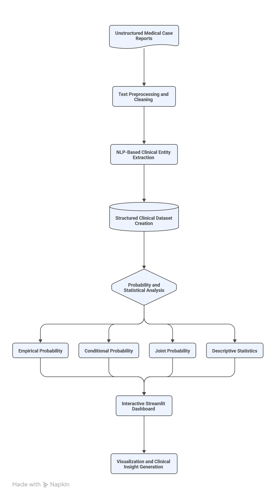

1. **Text preprocessing** — tokenization, normalization, section segmentation
2. **NLP entity extraction** — spaCy + custom regex; extracts MetHb %, trigger, treatment, outcome, G6PD status, demographics
3. **Statistical analysis** — empirical, conditional, and joint probability; descriptive statistics
4. **Dashboard** — Streamlit app with six analytical tabs

---

## Key Findings

| Metric | Value |
|--------|-------|
| Most common trigger | Benzocaine — P = 0.2609 |
| Severe case rate | 53.3% of cases |
| Mean MetHb | 37.17% (severe threshold) |
| P(Severe \| Age > 40) | 55.6% |
| P(Cyanosis \| Severe) | 100% |
| Pediatric severe rate | 100% of <18 cases |

---

## Dashboard

### Home
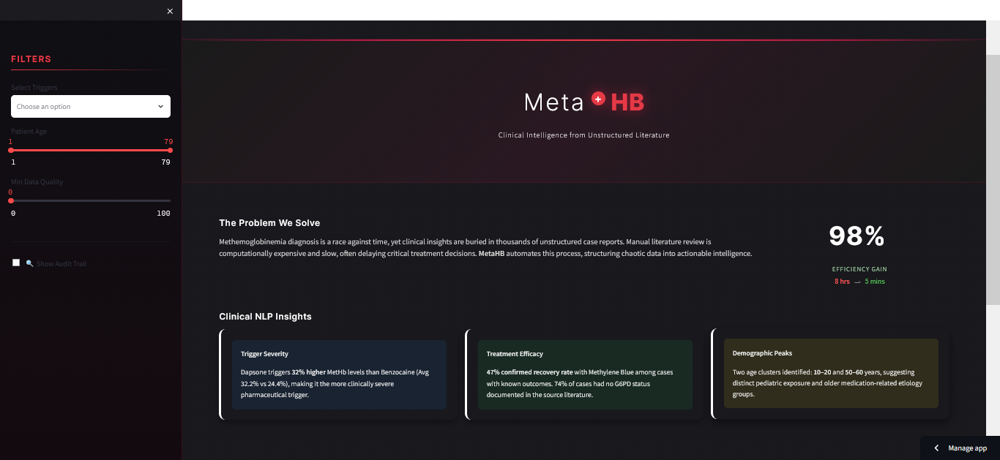

### Severity Analysis
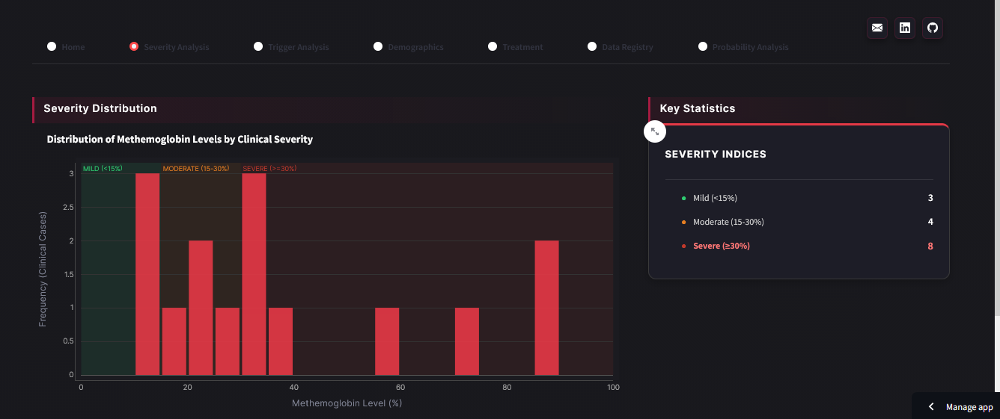

### Trigger Analysis
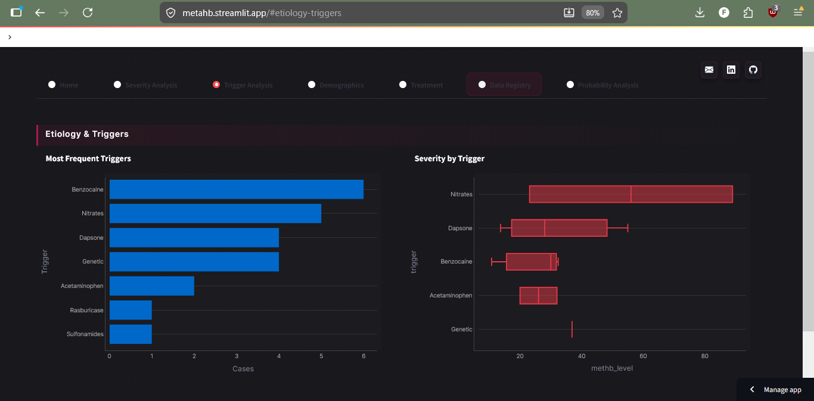

### Demographics
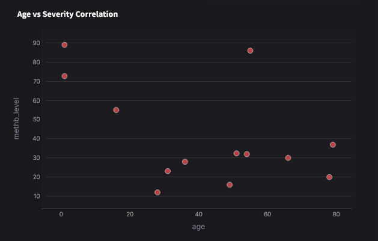
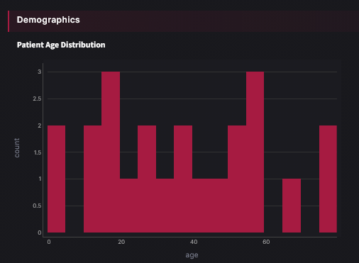

### Treatment Outcomes
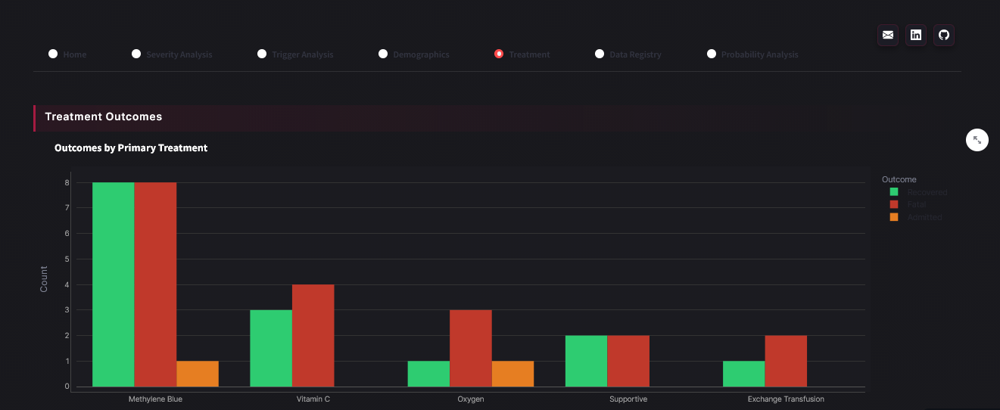

### Probability Analysis
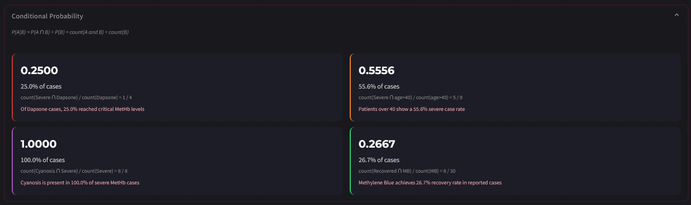
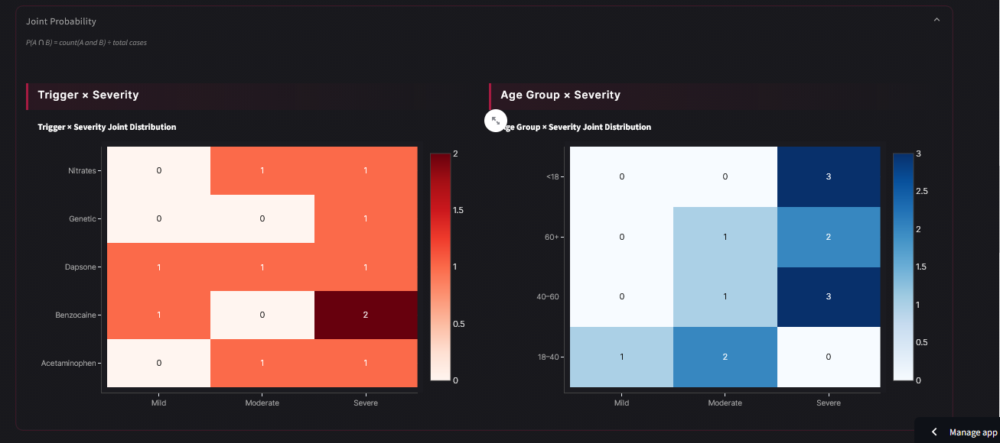
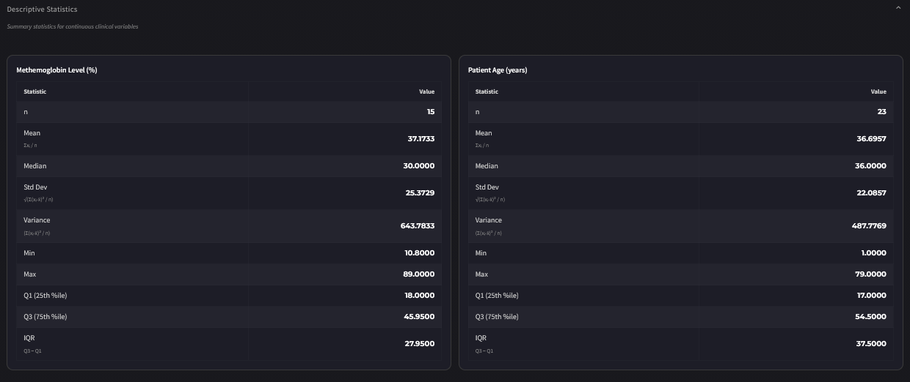
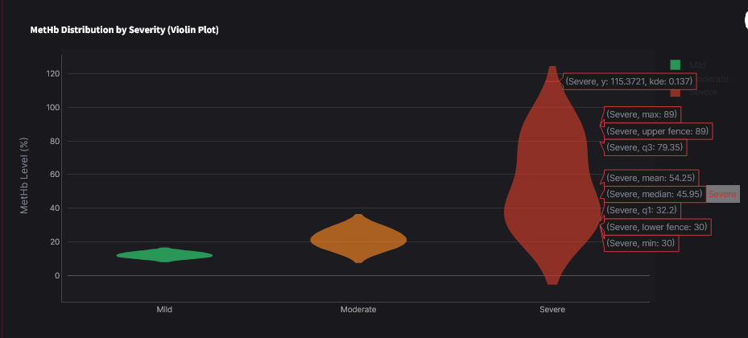

### Data Registry
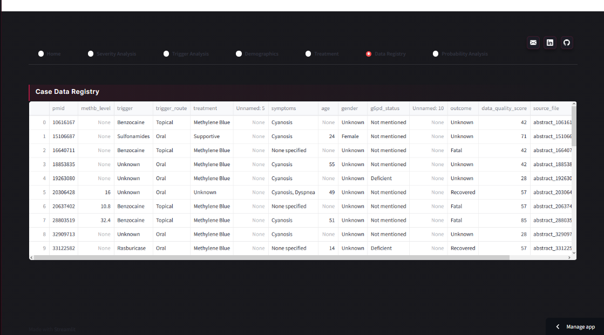

---

## Stack

| | |
|---|---|
| NLP | spaCy 3.8+, NLTK, Regex |
| Data | Pandas, NumPy |
| Extraction | PyPDF2, BeautifulSoup, Biopython |
| Visualization | Plotly, Matplotlib, Seaborn |
| Dashboard | Streamlit 1.29+ |

---

## Project Structure

```
├── dashboard.py
├── requirements.txt
├── scripts/
└── screenshots/
```

---

## Limitations

- N = 35 (small sample; rare disease)
- Publication bias toward severe presentations
- NLP accuracy ~85–90%
- G6PD status documented in only ~26% of cases

> Research/educational tool only. Not for clinical decision-making.

---

## Citation

```bibtex
@software{metahb_2025,
  author = {Fabeha Zahid Mahmood and Rawaha Ali and Ahsan Ali and Haseeb Ahmad Sardar and Soban Muhammad},
  title  = {MetaHB: NLP-Based Statistical Analysis of Methemoglobinemia Case Reports},
  year   = {2025},
  url    = {https://github.com/fabehazahid/methemoglobinemia-nlp-analysis}
}
```

---

**Author**: Fabeha Zahid Mahmood — [fabehazahid@gmail.com](mailto:fabehazahid@gmail.com) · [LinkedIn](https://www.linkedin.com/in/fabeha-zahid-mahmood-b5ba3228a)
